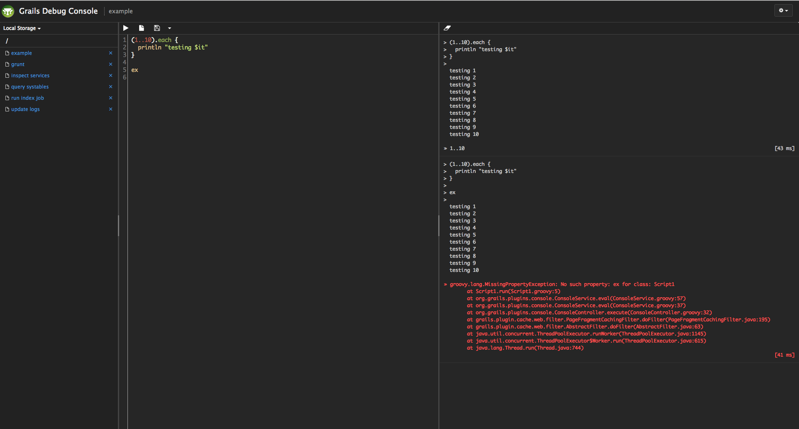
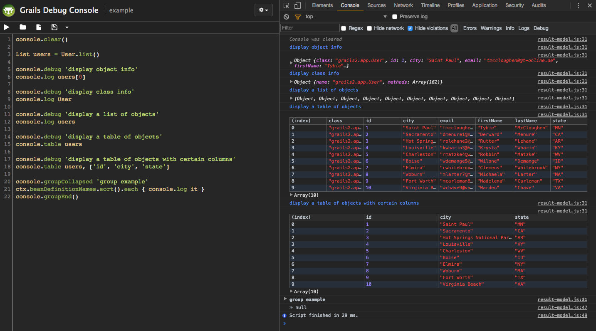

[](https://github.com/grails-plugins/grails-web-console/actions/workflows/gradle.yml)

# Grails Web Console

## Summary
A web-based Groovy console for interactive runtime application management and debugging



## Versions

- `1.X` for Grails 2
- `2.0.X` for Grails 3.0 - 3.2
- `2.2.X` for Grails 3.3+
- `4.X.X` for Grails 4+
- `5.X.X` for Grails 5+
- `6.X.X` for Grails 6+
- `7.X.X` for Grails 7+
- `8.X.X` for Grails 8+

### Webjars (8.x)

As of 8.x the plugin no longer bundles Bootstrap and Bootstrap Icons in its own
resources. It declares `org.webjars.npm:bootstrap` and
`org.webjars.npm:bootstrap-icons` as transitive runtime dependencies, served
through Spring Boot's standard `/webjars/**` classpath mapping. Two things
follow from this:

- If your security configuration restricts URLs, `/webjars/**` must remain
  reachable for the console page to be styled.
- The console links whatever webjar version your application actually resolves
  (your dependency management — typically the `grails-bom` platform — wins over
  the plugin's requested version), so overriding the Bootstrap version in your
  app is safe.

#### Supplying your own Bootstrap

An application that already ships Bootstrap — through asset-pipeline, its own
webjar dependency, or a CDN — can opt out of the plugin's copy:

```yaml
grails:
    plugin:
        console:
            bootstrap:
                enabled: false
```

That suppresses the `/webjars/**` `<link>` and `<script>` tags on the console
page. Drop the runtime dependencies too, so the jars stop shipping:

```groovy
implementation('org.grails.plugins:grails-web-console:8.0.0') {
    exclude group: 'org.webjars.npm', module: 'bootstrap'
    exclude group: 'org.webjars.npm', module: 'bootstrap-icons'
}
```

Bootstrap then becomes yours to supply. Point `grails.plugin.console.layout` at
a layout of your own that emits the tags ahead of `<g:layoutHead/>`, so the
console's own stylesheets still win the cascade:

```gsp
<head>
  <asset:stylesheet href="webjars/bootstrap/%/dist/css/bootstrap.css"/>
  <asset:stylesheet href="webjars/bootstrap-icons/%/font/bootstrap-icons.css"/>
  <asset:javascript src="webjars/bootstrap/%/dist/js/bootstrap.bundle.js"/>
  <g:layoutHead/>
</head>
```

`%` (or `*`) stands in for the version, so the layout survives a Bootstrap
upgrade — asset-pipeline matches it against the compiled manifest in production
and against its classpath resolvers in development. Keep exactly one version of
each webjar on the classpath: the wildcard takes the first manifest key that
matches, and iteration order is unspecified.

The console still needs Bootstrap 5 CSS, the Bootstrap Icons font CSS, and the
Bootstrap JS bundle — it renders unstyled without them.

## Installation

Add a dependency in build.gradle

```groovy
repositories {
    maven { url "https://repo.grails.org/grails/core/" }
}

dependencies {
    runtimeOnly 'com.github.grails-plugins:grails-web-console:7.0.0-M1'
}
```


## Usage

Use a browser to navigate to the /console page of your running app, e.g. http://localhost:8080/{app-name}/console

Type any Groovy commands in the console text area, then click on the execute button. The console plugin relies on Groovy Shell. Lookup Groovy Shell documentation for more information.
The Groovy Shell uses the Grails classloader, so you can access any class or artifact (e.g. domain classes, services, etc.) just like in your application code.

## Saving/loading scripts

Click on the `Save` button to save the current script.

Use the Storage pane to navigate existing files. Click on a file to load it into the editor.

There are currently two storage options available:

### Local Storage

Local Storage uses HTML5 [Web Storage](http://dev.w3.org/html5/webstorage/). The files are serialized and stored in the browser as a map under the key `gconsole.files`.

### Remote Storage

Remote Storage uses the filesystem of the server on which the application is running.

## Writing to the browser console

Calls made to the implicit `console` variable will be executed on the browser's console.
The arguments are serialized as JSON and the calls are queued to run after the script completes.

Example:


## Implicit variables

The following implicit variables are available:

* `ctx` - the Spring [ApplicationContext](http://static.springsource.org/spring/docs/3.0.x/javadoc-api/org/springframework/context/ApplicationContext.html)
* `grailsApplication` - the [GrailsApplication](http://grails.org/doc/latest/api/org/codehaus/groovy/grails/commons/GrailsApplication.html) instance
* `config` - the Grails configuration
* `request` - the current [HTTP request](http://java.sun.com/products/servlet/2.3/javadoc/javax/servlet/http/HttpServletRequest.html)
* `session` - the current [HTTP session](http://java.sun.com/products/servlet/2.3/javadoc/javax/servlet/http/HttpSession.html)
* `out` - the output [PrintStream](http://docs.oracle.com/javase/7/docs/api/java/io/PrintStream.html)

See [Script Examples](https://github.com/grails-plugins/grails-web-console/wiki/Script-Examples) for example usage.

## Keyboard Shortcuts

| Key | Command |
|---|---|
| Ctrl-Enter / ⌘-Enter | Execute |
| Ctrl-S / ⌘-S         | Save |
| Esc                  | Clear output |

## Configuration

The following configuration options are available:

| Property | Description |
|---|---|
| `grails.plugin.console.enabled`                  | Whether to enable the plugin. Default is true for the development environment, false otherwise. |
| `grails.plugin.console.baseUrl`                  | Base URL for the console controller. Can be a String or a List of Strings if having multiple URLs is desired. Default uses createLink(). |
| `grails.plugin.console.fileStore.remote.enabled` | Whether to include the remote file store functionality. Default is true. |
| `grails.plugin.console.fileStore.remote.defaultPath` | Default path when browsing remote files. Default is `/`. |
| `grails.plugin.console.layout`                   | Used to override the plugin's GSP layout. |
| `grails.plugin.console.newFileText`              | Text to display as a template for new files. Can be used to add frequently used imports, environment specific warnings, etc... Defaults to empty. |
| `grails.plugin.console.tabSize`                  | The width of a tab character. Defaults to 4. |
| `grails.plugin.console.indentWithTabs`           | Whether indents should use tabs rather than spaces. Default is false. |
| `grails.plugin.console.indentUnit`               | How many spaces a block should be indented. Default is 4. |
| `grails.plugin.console.csrfProtection.enabled`   | Whether to enable CSRF protection. Default is true. |

## Security

By default (as of v1.5.0) the console plugin is only enabled in the development environment. You can enable or disable it for any environment with
the `grails.plugin.console.enabled` config option in Config.groovy / application.groovy (Grails 3). If the plugin is enabled in non-development environments, be sure to guard access using a security plugin like Spring Security Core or Shiro. For Grails 2.x, the paths `/console/**` and `/plugins/console*/**` should be secured. For Grails 3.x, the paths `/console/**` and `/static/console/**` should be secured.

Spring Security Core example:

```groovy
grails.plugin.springsecurity.controllerAnnotations.staticRules = [
    [pattern:"/console/**",          access:['ROLE_ADMIN']],
    [pattern:"/static/console/**",   access:['ROLE_ADMIN']],
]
```

Another example restricting access to localhost IPs:

```groovy
grails.plugin.springsecurity.controllerAnnotations.staticRules = [
    [pattern:"/console/**",          access:["hasRole('ROLE_ADMIN') && (hasIpAddress('127.0.0.1') || hasIpAddress('::1'))"]],
    [pattern:"/static/console/**",   access:["hasRole('ROLE_ADMIN') && (hasIpAddress('127.0.0.1') || hasIpAddress('::1'))"]],
]
```

## Authors
* [Siegfried Puchbauer](https://github.com/ziegfried)
* [Mingfai Ma](https://github.com/mingfai)
* [Burt Beckwith](https://github.com/burtbeckwith)
* [Matt Sheehan](https://github.com/sheehan)
* [Mike Hugo](https://github.com/mjhugo)
* [Kamil Dybicz](https://github.com/kdybicz)
* [Sachin Verma](https://github.com/vsachinv)
* [James Daugherty](https://github.com/jdaugherty)
* [Scott Murphy](https://github.com/codeconsole)
* [Søren Berg Glasius](https://github.com/sbglasius)

## Development

Please see [CONTRIBUTING.md](CONTRIBUTING.md)

## Local deployment

Please see [LOCALDEPLOYMENT.md](LOCALDEPLOYMENT.md)
